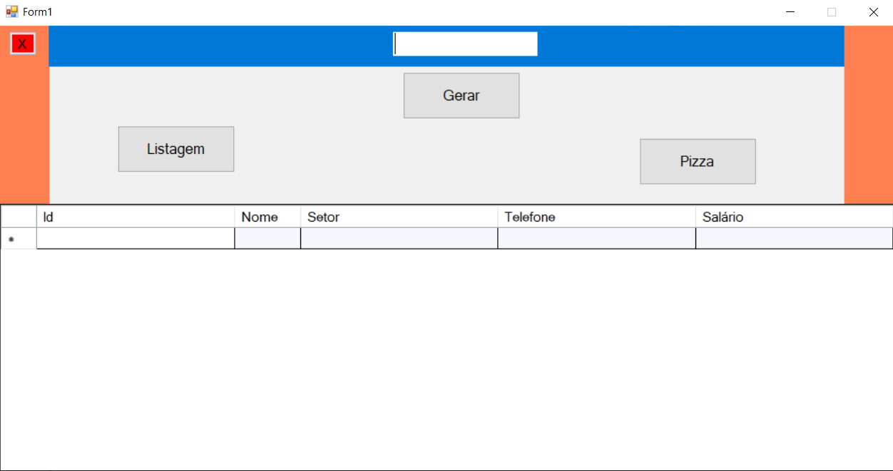

# Gerador De Dados Com Relatorio
 Aplicação de geração de dados em massa com suporte a geração de relatórios. Banco de dados SQL Server.

## Tecnologias

Esse projeto foi desenvolvido com as seguintes tecnologias:

- [C#](https://docs.microsoft.com/en-us/dotnet/csharp/)
- [SQL Server](https://www.microsoft.com/pt-br/sql-server/sql-server-downloads)

## Projeto

 Aplicação de geração de dados em massa com suporte a geração de relatórios. Banco de dados SQL Server.

## Licença

Esse projeto está sob a licença MIT. Veja o arquivo [LICENSE](LICENSE.md) para mais detalhes
